# CityOps Agent Harness — A Narrated Walkthrough

A guided tour of *why* this project exists and *how* each notebook works. Read it
top to bottom for the argument, or jump to a notebook. Diagrams show the real
mechanism, not a cartoon of it.

---

## 0 · The premise: why this project exists

The prerequisite workshop built the **CityOps Copilot** — an inspection agent with
memory. A design review of that copilot found that its memory worked in the demo
but would rot over a long horizon. Three failures, in the review's words:

> *promotion without curation · success without verification · growth without forgetting*

This project is the **harness** that fixes those failures and, crucially, **proves
it did** with an eval suite. Everything durable lives in **Oracle Autonomous
Database** (rows, vectors, scheduled jobs), and embeddings run **inside** the
database (ONNX), so no text ever leaves for a third-party embedder.

### Two memory paths

The review's failures split across two independent ways an agent accumulates
memory. Each notebook fixes one path and then measures it.

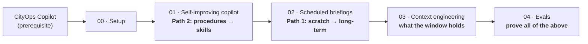

- **Path 2 (notebook 01)** — the agent turns *what it did* into reusable **skills**.
  Gaps fixed: capture the full trajectory (not just tool names), verify success
  against the database (not the prose), and let skills earn authority over time.
- **Path 1 (notebook 02)** — scratch notes **graduate** into long-term memory. Gaps
  fixed: curate before promoting, record provenance, let new facts supersede old
  ones, and actually schedule the pipeline.
- **Context (notebook 03)** — the working window itself: compaction and offloading,
  measured for **fidelity, not size**.
- **Evals (notebook 04)** — five experiments that grade exactly the gaps above.

### The architecture: two layers

A single idea shapes every notebook. **Decisions are pure; effects are in the
notebook.**

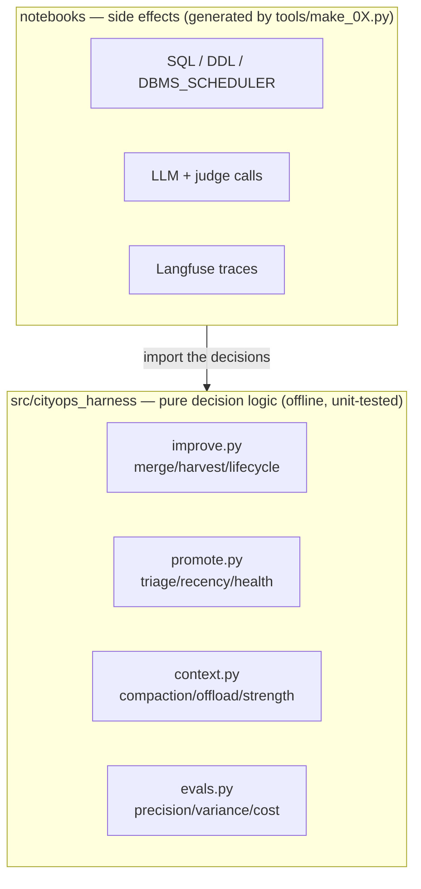

Why this matters: the *rules* (when to merge, when to promote, how to score) are
~450 lines of side-effect-free Python with **53 unit tests** that need no DB, no
LLM, no network. The notebooks wire those rules to Oracle and the model. When a bug
appears, it's almost always in the wiring — the rules are provable in isolation.

Two more conventions worth knowing:

- **Generated notebooks.** Each notebook is emitted by a `make_0X_notebook.py`
  script, and `make_student.py` strips the marked solution blocks to produce a
  learner (`*_todo`) flavor. One source of truth → the two flavors can't drift.
- **Independently runnable.** Every notebook opens by verifying the artifacts its
  predecessor should have left (`state.require`), with an idempotent backfill — so
  each runs alone, but continuity across them is itself the lesson.

---

## 1 · Notebook 00 — Setup

**Why:** fail fast and specifically. Every later notebook assumes a working
database, an in-DB embedding model, a reachable LLM, and (for notebook 04)
Langfuse. Notebook 00 checks each and ends every section with a green tick, so a
broken environment surfaces here — not five cells into notebook 02.

**How:** four probes.

| Section | Verifies | The subtle part |
|---|---|---|
| ADB connectivity | a pooled connection + `v$version` | `db.py` pools at 2 connections/process; the ADB caps at 30 sessions total |
| In-DB embeddings | `ALL_MINILM_L12_V2` loads and embeds | idempotent — re-running skips a present model |
| LLM provider | one `LLM_PROVIDER` drives both consumers | LangChain chat **and** the LiteLLM SDK path |
| Langfuse | `off` / `local` / `cloud` | optional for 00–03; **required** by 04 |

The reason one env var (`LLM_PROVIDER`) is emphasized: the same switch feeds two
different clients — LangChain (for agent/chat calls) and LiteLLM (for the Oracle
Agent Memory SDK). Notebook 00 constructs both so a provider misconfiguration is
caught once, here.

---

## 2 · Notebook 01 — The self-improving copilot (Path 2)

**Why:** the review's Path-2 verdict was that the original harness "learned" from a
*sorted set of tool names* and called any run with a final answer a success. You
can't distill a reliable procedure from a set of names, and you can't trust a
success you never checked. This notebook rebuilds learning so it's grounded and
verified.

The full cycle is `run_and_learn`: **act → judge → capture → harvest**, all inside
one trace.

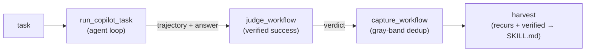

### 2.1 · Tools registered by meaning, retrieved with a floor

Each tool's `name: description` is embedded into `HARNESS_TOOLS`. `retrieve_tools`
ranks by cosine distance and **cuts everything past a threshold** — so an
off-topic task binds *no* tools rather than the least-bad four. The threshold is
the point, not the top-k.

### 2.2 · The agent loop captures the *full* trajectory

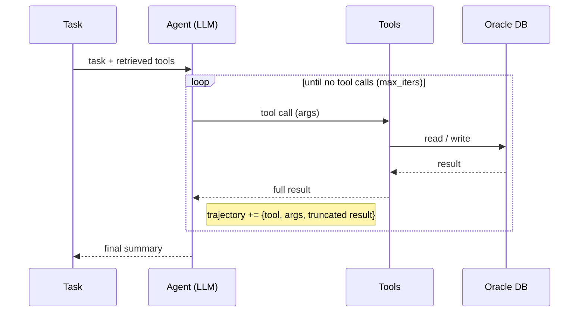

Every step records the **tool, its arguments, and a truncated result, in order** —
the record the judge audits and skills distill from. A tool error becomes `ERROR:`
text in the message, not a crash, so the model can recover *and* the failure stays
visible in the trajectory.

### 2.3 · Verified success: the judge audits the database, not the prose

This is the heart of the Path-2 fix. `success = bool(final)` let confident nonsense
pass. Instead:

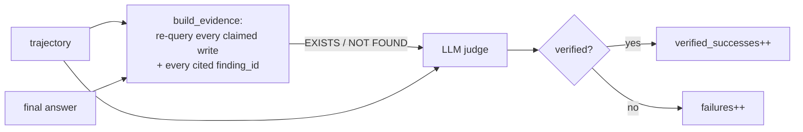

`build_evidence` goes back to `CITY_INSPECTION_FINDING` and re-queries every finding
the run *claims* to have written and every `finding_id` it *cites*, tagging each
`EXISTS` or `NOT FOUND`. The judge sees task + trajectory + answer + that evidence
and returns a structured `verified: bool`. Only a verified run feeds the success
count, and the verdict is logged to Langfuse as a score.

### 2.4 · Capture: dedup by meaning, with an honest gray band

A fixed cosine cutoff both under-merges paraphrases and over-merges neighbours.
`merge_decision` splits three ways and asks the model only in the uncertain band:

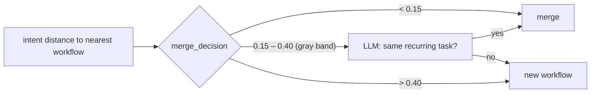

On merge, a **verified** run increments `verified_successes` and overwrites `steps`
with the latest verified trajectory; an unverified one increments `failures`. That
counter split is what stops a repeatedly-failing task from ever being harvested.
(Honest limitation, stated in the notebook: a phrasing *past* the `new` boundary
still splits silently — the gray band narrows the failure, doesn't remove it.)

### 2.5 · Harvest, and skills that earn authority

`harvest_ready` promotes a workflow only when it **recurs and verifiably works** —
`occurrences ≥ 3 AND verified_successes ≥ 2 AND verified_successes > failures`. A
candidate is distilled from the full trajectory, then a **second model call checks
the distilled steps back against that trajectory**; an unfaithful distillation is
rejected and nothing is written. Skills are then born *provisional* and earn their
authority:

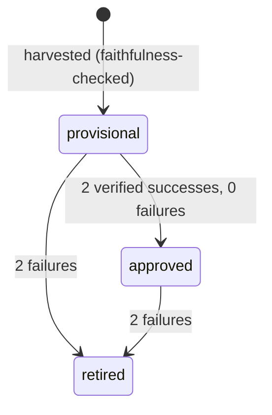

An approved skill is injected as "prefer this approach"; a provisional one as an
unproven candidate — same retrieval, different prompt authority. Each skill records
the **schema fingerprint** it was distilled against, so a skill built on an old
schema can be flagged stale at retrieval.

### 2.6 · Closing the loop: the copilot as a producer (§8b)

The final section connects Path 2 to Path 1. The copilot gets a `remember(asset_id,
note, durable)` tool and files durable findings for notebook 02 to curate. The
design choice worth internalizing: **the agent is never told about directories.**
It judges only *"is this worth keeping?"*; the tool files `durable=True` into
`/inbox` (notebook 02's opt-in area) and `durable=False` into `/work` (scratch).
Placement is policy the tool owns; the agent supplies judgement.

---

## 3 · Notebook 02 — Scheduled briefings (Path 1)

**Why:** the review's Path-1 verdict — *"everything graduates within the hour, 200-
word chunks get re-extracted into confident misreadings, nothing has provenance,
nothing is forgotten, and the consumer is never actually scheduled."* This notebook
rebuilds scratch→long-term promotion as a **curated, provenanced, scheduled**
pipeline.

The scratch store is a small filesystem-in-a-table: each note is a row with a
**path** (a policy label), content, and a status.

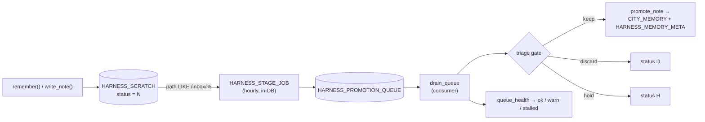

### 3.1 · Two gates, cheap before expensive

Curation happens **before** anything is durable, in two stages:

1. **Path gate** — `triage_allowed(path)` is one line: `path.startswith("/inbox/")`.
   Anything in `/work` or `/tool_out` is rejected with no LLM call. The *writer*
   already signalled intent by choosing the folder.
2. **LLM triage** — for notes that survive the path gate, a model call returns
   **keep / discard / hold**, catching junk that was filed in `/inbox` anyway.

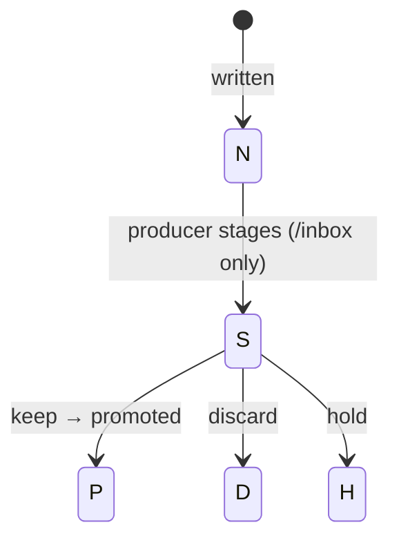

### 3.2 · Whole-note promotion + a queryable provenance sidecar

Curated notes are stored **verbatim** as one memory (`extract_memories=False`) — no
chunk-and-reinterpret. Alongside the SDK's `CITY_MEMORY`, a `HARNESS_MEMORY_META`
sidecar records **source path, content revision, and `superseded_by`** as plain
SQL you can query. Promotion is **idempotent per path**: a note promoted again
replaces its prior memory rather than piling up duplicates.

### 3.3 · Supersession: new facts retire old ones

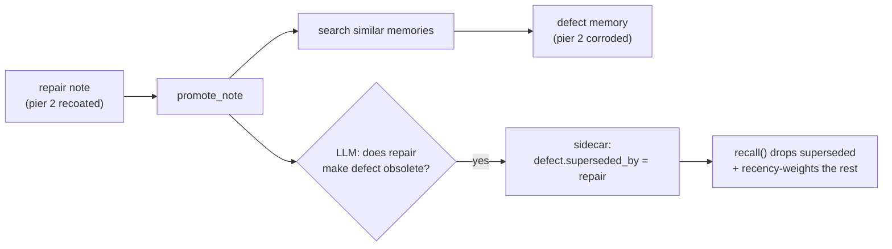

Recall runs the SDK relevance search, joins the sidecar to **drop superseded
memories and attach provenance**, then recency-weights what remains
(`rerank_by_recency`, a half-life decay) so the present outranks the stale past.

### 3.4 · Actually scheduled, with a pulse

The review's sharpest point: the producer was scheduled but the consumer only ran
when a human ran a cell — *"silently half-works, which is worse than visibly
failing."* Here the **producer** (`HARNESS_STAGE_JOB`) is pure SQL inside the
database on an hourly schedule; the **consumer** drains the queue; and
`queue_health` turns depth + age into an **ok / warn / stalled** status a dashboard
can alert on. The payoff is a scheduled **morning briefing**: the database computes
the numbers (no LLM in the loop, so it can't hallucinate a figure) and the model
only narrates them.

---

## 4 · Notebook 03 — Context engineering

**Why:** the review's critique of the original context work was that it measured
**size**, not **fidelity**. A card that forgot everything looks best on a size
chart. The only interesting question is what the smaller context still *knows*.

### 4.1 · Compaction, measured by a probe

A deterministic 40-turn "season" (built from real findings, seeded, with **3
planted facts** at known turns) is folded into a versioned card whenever the
pending transcript hits a budget.

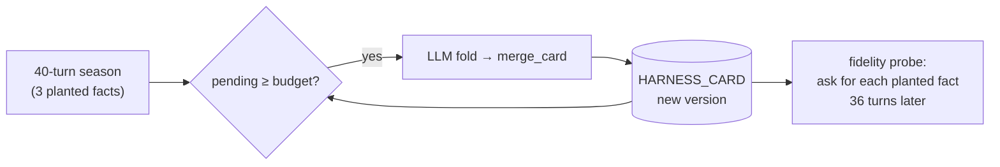

The probe is the point: 36 turns after planting, ask the question whose answer
*requires* that fact, using **only the card**. Recall is scored, and the assertion
is deliberately **not 100%** — compaction really does lose things, and a notebook
that only passes when nothing is ever lost would be teaching a fiction.

### 4.2 · Making it forget on purpose — strength-based consolidation (§4b)

The base card is **additive** (nothing may leave) — which keeps the probe honest
but means it never compresses. §4b adds the two things a real card needs: a
**ceiling** (a reason to compress) and a principled rule for **what gives way**.
That rule is *not* age (TTL); it's **retrieval strength**.

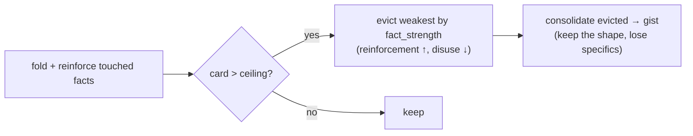

A fact then lives in one of three states — the measure a hit/miss recall can't
express:

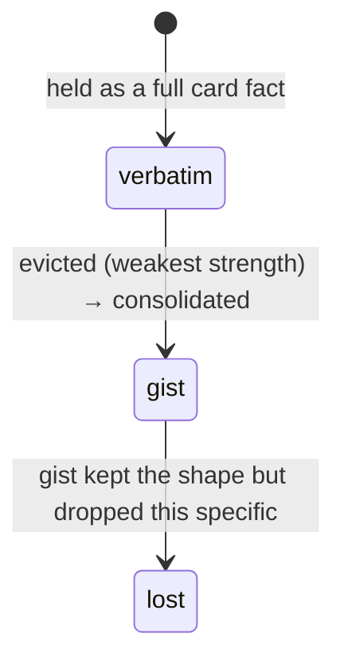

`fact_strength = (1 + reinforcements) * 0.5 ** (turns_since_reference / half_life)`
— the same half-life shape as recency recall in notebook 02, so the codebase carries
one decay model. The live result: over the same season the additive card grows past
the transcript while the strength card **holds its ceiling**, and `fact_status`
reports each planted fact as verbatim / gist / lost — a *measured* loss, not a
hidden one.

### 4.3 · Offloading with the agent in the loop

Compaction manages the conversation; offloading manages the **attachments**. A large
tool result is stored and the model is handed a **reference**, not the data.

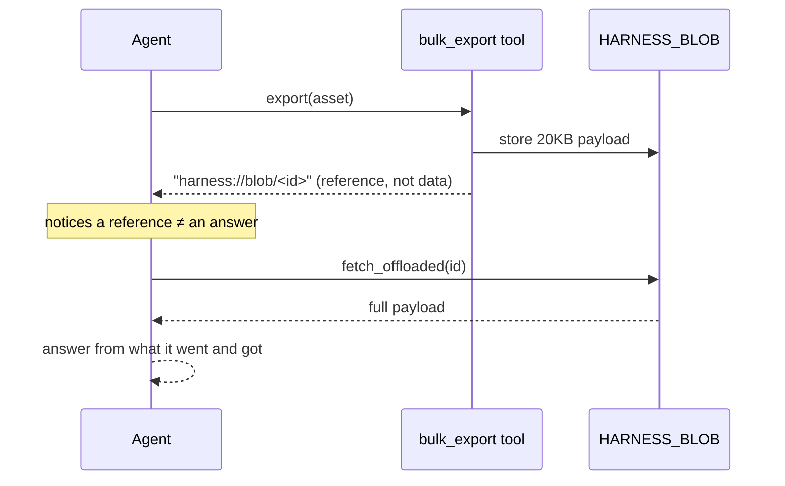

The test is **behavioural**, not "the bytes are recoverable": the model must notice
the reference, fetch it, and use it. The check confirms the answer names an **opaque
`finding_id`** that only exists in the payload — proof it was actually read.

Finally, the **offload × promotion exclusion**: blob paths (`/tool_out/blob/…`) are
run through notebook 02's real gate and refused, while a genuine `/inbox` note still
promotes — so machine-generated dumps never masquerade as durable memories.

---

## 5 · Notebook 04 — Evals

**Why:** *measure what you claimed to fix, or you didn't fix it.* Five evals, each a
Langfuse dataset with scored traces, each grading a specific gap the earlier
notebooks addressed.

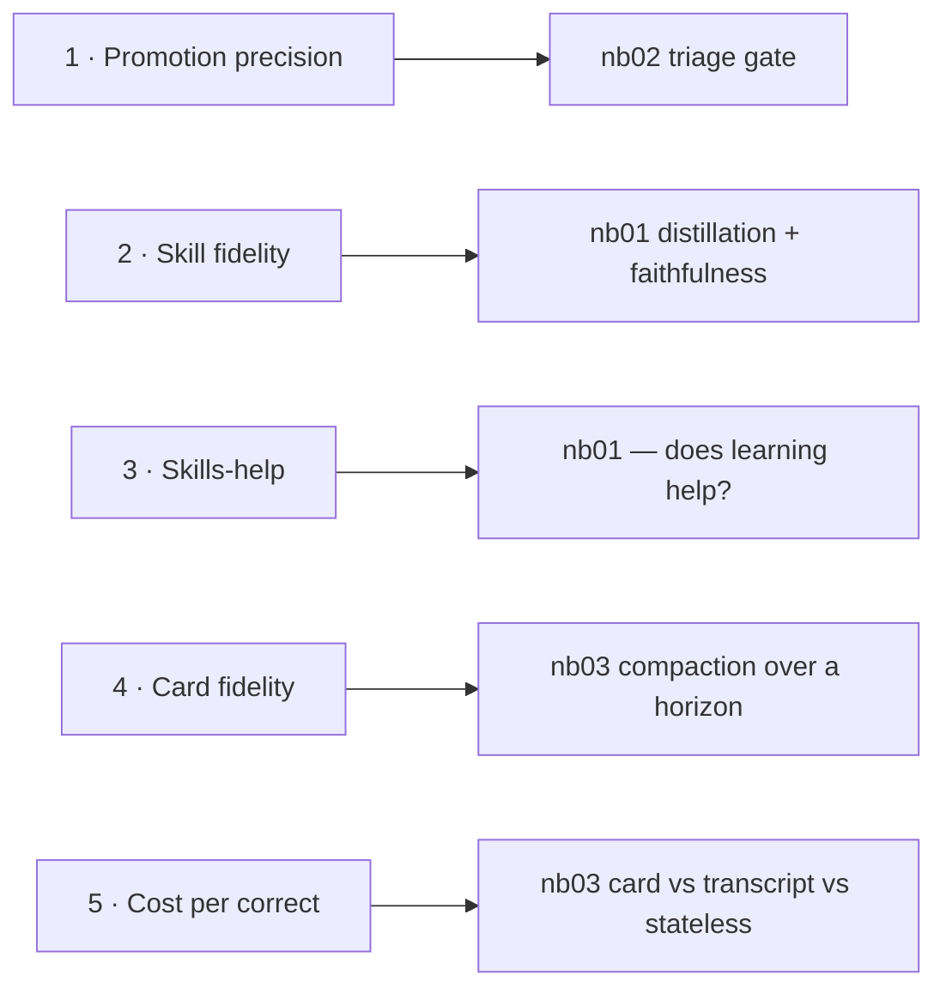

Each eval builds a labelled dataset, runs it through `dataset.run_experiment(task,
evaluators)` (Langfuse 4.x Experiments API), scores every item on the server, and
rolls the scores into one `check` plus a row in `HARNESS_EVAL`:

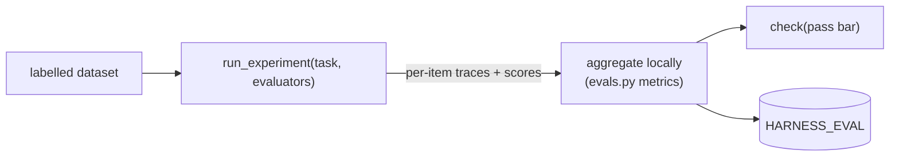

- **Promotion precision** — precision/recall of the triage gate on a signal+junk corpus.
- **Skill fidelity** — an LLM judge scores distilled skills, with a **tampered
  control** proving the judge isn't a rubber stamp.
- **Skills-help** — the review's missing experiment: the agent *with* vs *without*
  harvested skills, judge-scored.
- **Card fidelity over a horizon** — planted facts probed after adversarial spacing.
- **Cost per correct answer** — card vs full transcript vs stateless, with variance.

This is where "through Langfuse" stops being optional: notebook 04 requires the
local stack up, because the evals *are* datasets with scored runs.

---

## 6 · The design principles, distilled

Six ideas recur across every notebook. If you internalize these, the code reads
itself:

1. **Pure decisions, effectful edges.** Rules live in `src/` (tested offline);
   SQL/LLM/Langfuse live in the notebooks. Bugs hide in the wiring, not the rules.
2. **Cheap check before expensive check.** A path prefix rejects junk before any LLM
   call; a distance floor drops off-topic tools before the model sees them.
3. **Verify against ground truth, not prose.** The judge re-queries the database; the
   offload test demands an id only present in the payload. Never trust the model's
   own summary of what it did.
4. **The tool owns policy; the agent supplies judgement.** `remember` decides *where*;
   the agent decides *whether*. Fewer things for the model to get wrong.
5. **Measure loss, don't hide it.** Compaction is allowed to forget — and the probe
   reports exactly what fell out (verbatim / gist / lost). An honest red beats a
   dishonest green.
6. **Idempotent + re-runnable.** Promotion replaces per path; resets clear the right
   tables; each notebook backfills what it needs. State that accumulates silently is
   the enemy (most bugs found in review were exactly this).

---

## 7 · Known gaps (honest limitations)

This project is a teaching harness, not production, and a deep review found real
gaps. Some are fixed; the rest are tracked. Kept here because pretending they don't
exist would violate principle #5.

| Area | Gap | Status |
|---|---|---|
| nb03 / `context.py` | `merge_card` wiped strength bookkeeping on re-list | **fixed** |
| nb01 | not re-runnable — `promoted='Y'` never reset, 2nd run fails at harvest | identified |
| nb02 | recency recall inert — sidecar never stores `days_ago` | identified |
| nb03 | `fact_status` matches model-invented ids (tests coincidence, not retention) | identified |
| nb04 | eval 5 crashes (`round(None)`) on the card-lost-a-fact case it exists to catch | identified |
| nb04 | eval 3 passes vacuously on `0 ≥ 0` — doesn't enforce "skills help" | identified |
| nb02 | `hold` notes are never re-triaged (stranded) | identified |
| nb00 | Langfuse check is a false-green — `flush()` never raises | identified |
| nb01 | skill staleness is a cosmetic label; `schema_sha` ignores length/nullability | deferred |

The pattern behind most of them is principle #6: **silent state accumulation** —
duplicates, un-reset flags, unpopulated columns — breaking a downstream assertion
one run later. That's the class of bug this kind of deep, trace-the-logic review is
best at catching.
