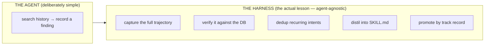
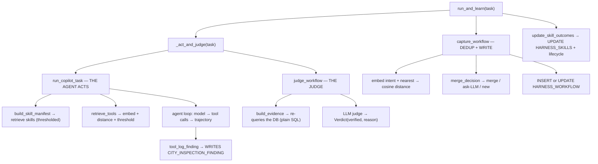
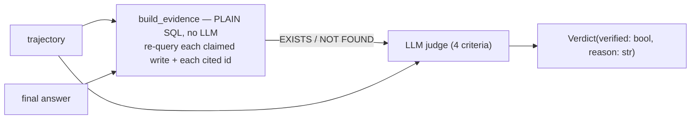
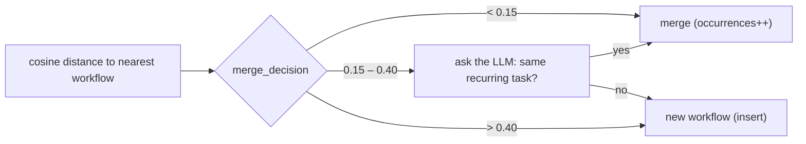
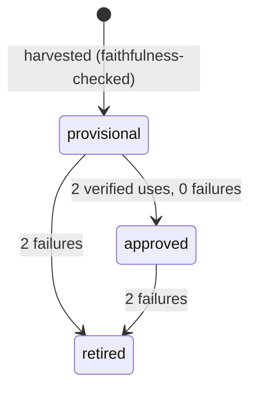

# Notebook 01 — The Self-Improving Copilot, Explained

A detailed, plain-language reference for `01_self_improving_copilot`. The code
interlocks a lot of small functions; this document is the map. Read it beside the
notebook.

> **The one-sentence version:** a deliberately *simple* inspection agent runs
> tasks, and a *harness* wrapped around it captures what it did, verifies the work
> against the database, recognises recurring work, and distils it into reusable
> skills that earn authority over time.

---

## 0 · The mental model: the agent is the toy, the harness is the point

The copilot itself does almost nothing clever. Given a task, it:

1. searches similar past findings (to ground its assessment),
2. records a new finding with a recommendation,
3. cites the finding's id in its answer.

That's it — "**search → log**." It has exactly three tools and no long-term
cleverness. **This simplicity is deliberate.** Notebook 01 is not teaching you to
build a great inspection agent; it is teaching you to build the **harness** that
makes *any* agent self-improving. If the agent were sophisticated, the harness
machinery would be buried under domain complexity.



Swap in a 20-tool agent doing multi-step repairs and **the harness code does not
change** — `run_and_learn` still captures, the judge still audits, dedup still
merges, harvest still distils. The "search → log" copilot is just the smallest
agent that makes the learning loop non-trivial, because it has a **checkable side
effect** (a database row) that the judge can verify instead of guess.

---

## 1 · The data model — five tables

Two are **domain** data (the world the copilot inspects); three are **harness**
state (what it learns).

| Table | Kind | Holds |
|---|---|---|
| `CITY_ASSET` | domain | the bridges/assets being inspected |
| `CITY_INSPECTION_FINDING` | domain | every finding ever recorded (the system of record) |
| `HARNESS_TOOLS` | learned-ish | each tool's `name: description` + its embedding (declared, not learned) |
| `HARNESS_WORKFLOW` | learned | captured recurring procedures (intent + embedding + trajectory + counters) |
| `HARNESS_SKILLS` | learned | distilled `SKILL.md` documents with a lifecycle status |

`HARNESS_WORKFLOW` and `HARNESS_SKILLS` are the **learned state** — they start
empty and fill up as the notebook runs. (The notebook clears their rows at
startup so every run starts fresh; see §7.)

---

## 2 · The core loop: `run_and_learn`

One call fans out into ~7 functions and writes to three tables. This is the whole
notebook in one function.



**DB writes per call:** `CITY_INSPECTION_FINDING` (+1 finding, if recorded),
`HARNESS_WORKFLOW` (insert or update), `HARNESS_SKILLS` (counters/status, if a
skill was used).

§7c of the notebook ("Anatomy of one `run_and_learn`") runs this same call **in
slow motion** — calling each sub-function by hand and printing which table each
write lands in. If you want to *watch* the process, that's the section.

---

## 3 · The mechanisms, one at a time

### 3.1 · Tools: registered by meaning, retrieved with a floor

Each tool's `name: description` is embedded (in-database ONNX, 384-dim) into
`HARNESS_TOOLS`. At task time, `retrieve_tools` embeds the task, ranks tools by
cosine distance, and **drops anything past `TOOL_DISTANCE_MAX = 0.92`**:

```python
rows = improve.filter_by_distance(rows, TOOL_DISTANCE_MAX)   # the threshold is the point
```

The threshold, not the top-k, is the design: an off-topic task binds **no** tools
rather than the least-bad four. (Known wrinkle: 0.92 sits close to the range of
*relevant* tool distances, so a task whose wording drifts can occasionally drop a
tool it needed — see §8.)

### 3.2 · The agent loop and full-trajectory capture

`run_copilot_task` binds the retrieved tools and iterates **model → tool calls →
results → model** until the model stops calling tools. Every step is recorded:

```python
trajectory.append({"tool": tc["name"], "args": tc["args"],
                   "result": improve.truncate_result(result)})   # ordered, with args + result
```

This is the review fix that everything downstream depends on: the original
harness stored a *sorted set of tool names* — nothing to distil from. Here you get
the **ordered tool calls, their arguments, and truncated results**. A tool error
becomes `ERROR: …` text in the message (not a crash), so the model can recover and
the failure stays visible in the trajectory.

The agent returns `{answer, trajectory, skill_ids}`.

### 3.3 · The judge: verified success

**The problem it fixes:** `success = bool(final)` let confident nonsense pass. The
fix is to **audit the database, not the prose** — and it has two layers.



**Layer 1 — `build_evidence` (deterministic).** An ordinary Python function that
runs SQL directly:

```python
cur.execute("SELECT ... FROM CITY_INSPECTION_FINDING WHERE finding_id = :f", f=fid)
```

It re-queries every finding the trajectory *claims* to have written and every
`finding_id` *cited* in the answer, tagging each `EXISTS` / `NOT FOUND`. **This is
not a tool.** It is hardcoded SQL that runs *before* the model sees anything — so
the ground truth is non-negotiable and the LLM can't skip it, misuse it, or be
talked out of it.

**Layer 2 — the LLM judge.** Reads task + trajectory + answer + that evidence and
decides `verified` against **four** criteria:

| | criterion | answered by |
|---|---|---|
| (a) | did it follow the procedure? (search *before* recording; record when asked) | LLM over the **trajectory** |
| (b) | is every claimed DB write confirmed? | the **SQL evidence** |
| (c) | does every cited `finding_id` EXIST? | the **SQL evidence** |
| (d) | does the answer avoid contradicting the trajectory / inventing records? | LLM over the **answer** |

So the finding-id lookup answers **(b) and (c)**; **(a) and (d)** are judgments a
query can't make (did it skip the record step? does the prose oversell?). The SQL
is the *trustworthy floor*; the LLM reasons on top of it.

**Citations** are `finding_id`s the copilot puts in *its own* final answer — its
system prompt tells it to "cite its finding_id." Two kinds: the id it just created
(`tool_log_finding` returns it) and prior ids it found while searching. The judge
re-checks every one exists — catching the agent inventing a reference in prose.
(That's the §7c STEP 4b "teeth" demo: splice a fake `deadbeef-000` into the
answer → `NOT FOUND` → `verified=False`.)

**Structured output.** `_judge_model = CHAT.with_structured_output(Verdict)` makes
`.invoke()` return a typed `Verdict(verified=bool, reason=str)` — not prose to
regex. Mechanically, LangChain (1) derives a JSON schema from the `Verdict`
Pydantic class, (2) binds it to the model's tool-calling API and forces the model
to fill it, (3) parses + validates the result back into a `Verdict` object. So
`verdict.verified` is a real boolean the code branches on. The same pattern
(`Distilled`, `Faithful`, `SameTask`, `Triage`) appears everywhere a decision is
needed.

Only a **verified** run feeds the success count; the verdict is also logged to
Langfuse as a score.

### 3.4 · Capture: intent, embedding, and gray-band dedup

After act+judge, `capture_workflow(intent, run, verified)` decides whether this
run is a *new* recurring procedure or *another occurrence* of an existing one.

- **`intent`** = the task text, **stored verbatim**. Whoever calls `run_and_learn`
  defines it (in the notebook, the hand-written occurrence strings). No LLM
  derives it. On a *merge*, the intent text is **frozen** at the first
  occurrence's wording; only the embedding refreshes.
- **`intent_embedding`** = that text as a 384-dim vector, so "the same task,
  reworded" can be recognised by cosine similarity.



The three-band rule (`merge_decision`) exists because a single fixed cutoff both
under-merges paraphrases and over-merges neighbours. The **gray band** hands the
ambiguous cases to a cheap LLM "same task?" check before the counters are
polluted. On merge, a **verified** run bumps `verified_successes` and overwrites
`steps` with the latest verified trajectory; an unverified one bumps `failures`.
That counter split is what stops a repeatedly-failing task from being harvested.

§7c STEP 5b shows this live with real numbers — e.g. `distance=0.158 → gray band →
LLM says merge`, `off-topic 1.013 → new`.

### 3.5 · Harvest: distil a `SKILL.md`, faithfulness-checked

`harvest()` promotes a workflow only when it **recurs AND verifiably works** —
`harvest_ready`:

```python
occurrences >= 3  AND  verified_successes >= 2  AND  verified_successes > failures
```

For each qualifying workflow, `promote_workflow_to_skill`:

1. **distils** the *full trajectory* (tools + args + results) into `{name,
   description, when_to_use, steps_body}` — grounded in what actually ran;
2. runs a **faithfulness check** — a second model call comparing the distilled
   steps back against the trajectory. If it says unfaithful, the skill is
   **rejected and nothing is written**;
3. renders a `SKILL.md` (YAML frontmatter + `## When to use` + `## Steps`), stamps
   it with the **schema fingerprint** (`schema_sha`), and inserts it as
   **`status = 'provisional'`**.

A skill is **born unproven**. It never gets authority at creation.

### 3.6 · Lifecycle: earn authority, or get retired

Retrieval injects skills two-level: `retrieve_skills` cuts at
`SKILL_DISTANCE_MAX = 0.65`, and `build_skill_manifest` orders **approved before
provisional**, labelling each with the authority it has actually earned (an
approved skill as "prefer this approach"; a provisional one as an unproven
candidate to verify).

Each run's verdict flows back via `update_skill_outcomes`, and
`lifecycle_transition` applies it:



Nothing approves a skill except its own track record — two verified runs that used
it, with no failures. (Promotion to *approved* is genuinely stochastic: it needs
two verified *uses*, and verification can fail, so a skill legitimately *staying*
provisional is the gate holding, not a bug.)

**Staleness.** Each skill records the `schema_sha` it was distilled against;
retrieval re-checks it against the current schema and labels a mismatch `[STALE]`.
(Honest limitation: today this only *labels* — it does not retire the skill or
remove it from retrieval; and `compute_schema_sha` hashes only column
name+type, ignoring length/nullability. See §8.)

### 3.7 · The producer (§8b): the copilot writes memory

The closing section connects notebook 01 to notebook 02. The copilot gets a
`remember(asset_id, note, durable)` tool and files durable findings for notebook
02's pipeline to curate. The design choice: **the agent is never told about
directories.** It judges only "is this worth keeping?"; the *tool* files
`durable=True` into `/inbox` (notebook 02's opt-in area) and `durable=False` into
`/work` (scratch). Placement is policy the tool owns; the agent supplies
judgement.

### 3.8 · A real captured workflow row (worked example)

Abstract descriptions only go so far — here is an actual `HARNESS_WORKFLOW` row
the harness captured during a run, so you can see what `intent`, `steps`, and the
counters really contain.

**The row (counters + intent):**

```
workflow_id = bb1f9896-4b1   occurrences=4  verified_successes=4  failures=0  promoted=Y
intent      = "Inspect Harbor Bridge: heavy corrosion on the bearing plates at pier 2.
               Assess severity against past findings and record a finding with your recommendation."
```

**`steps` — the trajectory, a list of `{tool, args, result}` dicts in order:**

```python
[
  { "tool": "tool_find_similar_findings",                 # STEP 1 — search history FIRST
    "args": { "description": "surface corrosion staining under deck drainage outlets...",
              "asset_id": "Riverside Pedestrian Bridge", "k": 5 },
    "result": '[{"finding_id": "6bbddab7-3a1", "severity": "medium", ...}, ...]'   # priors (truncated to 300 chars)
  },
  { "tool": "tool_log_finding",                           # STEP 2 — record the new finding
    "args": { "asset_id": "Riverside Pedestrian Bridge", "category": "corrosion",
              "severity": "medium",
              "description": "Corrosion staining... Consistent with prior findings
                              6bbddab7-3a1, f53c2c66-14f, 2c931c49-d17...",
              "recommendation": "..." },
    "result": "78b69385-124"                              # ← the finding_id it created
  }
]
```

**The same trajectory as the judge reads it** (`improve.trajectory_to_text`):

```
Step 1: tool_find_similar_findings
  args: {"description": "surface corrosion staining...", "asset_id": "Riverside Pedestrian Bridge", "k": 5}
  result: [{"finding_id": "6bbddab7-3a1", "severity": "medium", ...}] ...[truncated]
Step 2: tool_log_finding
  args: {"asset_id": "Riverside Pedestrian Bridge", "category": "corrosion", "severity": "medium", "description": "..."}
  result: 78b69385-124
```

**How the judge uses exactly this:**

- **`build_evidence` (SQL):** finds the `tool_log_finding` step, takes its result
  `78b69385-124`, and re-queries `CITY_INSPECTION_FINDING` → `EXISTS`. It also
  checks the prior ids the description cites (`6bbddab7-3a1`, …).
- **Criterion (a):** Step 1 (search) precedes Step 2 (log), and a finding *was*
  recorded → procedure followed. (A trajectory with only Step 1 fails here.)
- **Citations:** the `finding_id`s in the description/answer are the "citations"
  the judge re-verifies.

**What this row proves about `intent` vs `steps`:** the `intent` says **Harbor
Bridge**, but the trajectory is a **Riverside Pedestrian Bridge** run. That's the
mechanism working as designed — `intent` is *frozen at occurrence 1's wording*
(used only for identity/dedup), while `steps` is *overwritten with the latest
verified trajectory* (used for distillation). When this workflow harvested
(`promoted=Y`), the `SKILL.md` was distilled from **this Riverside trajectory** —
the grounded record of tools + args + results — not from the Harbor-Bridge intent
text.

---

## 4 · Reliability details

**Retry until verified (`max_tries`).** Agent behaviour is stochastic — it
sometimes skips the record step or cites an unconfirmed id, which the judge
*correctly* rejects. So the teaching arc's occurrences pass `max_tries=3`:
`run_and_learn` retries act→judge until verified, and **captures only the final
attempt** so retries never pollute the counters. Harvest is therefore reliable;
skill *promotion* remains stochastic (needs two verified uses).

**Re-runnable (learned-state reset).** The registry-setup cell clears the *rows*
of `HARNESS_WORKFLOW` and `HARNESS_SKILLS` at startup (never `CITY_%` domain
data), so a second run doesn't inherit stale skills/workflows. Without this, a
re-run failed at the harvest assertion (leftover `promoted='Y'`) and §7c STEP 2
showed a leftover skill instead of "none."

---

## 5 · Reading guide — notebook section → mechanism

| Notebook § | Function(s) | Mechanism |
|---|---|---|
| 0–1 Setup / Bootstrap | `get_connection`, `OracleONNXEmbedder`, `classify_asset` | env, embedder, domain seed |
| 2 Registry DDL | `_table_exists`, learned-state reset, `current_schema_sha` | the three tables + fingerprint |
| 3 Toolbox | `tool_*`, `register_tool`, `retrieve_tools` | tools by meaning + threshold (3.1) |
| 4 Agent loop | `run_copilot_task` | act + trajectory capture (3.2) |
| 5 Judge | `build_evidence`, `Verdict`, `judge_workflow`, `record_score` | verified success (3.3) |
| 6 Capture | `merge_decision`, `_nearest_workflow`, `capture_workflow`, `run_and_learn` | gray-band dedup + the loop (3.4, 2) |
| 7 Harvester | `harvest_ready`, `promote_workflow_to_skill`, `harvest`, `build_skill_manifest`, `update_skill_outcomes` | distil + lifecycle (3.5, 3.6) |
| **7c Anatomy** | *(reuses all of the above)* | one `run_and_learn` in slow motion |
| 8 The arc | `run_and_learn` ×5, `harvest` | recur → verify → harvest → approve |
| 8b Producer | `remember` | the copilot as a memory producer (3.7) |

**Why the generator looks unreadable:** you edit `tools/make_01_notebook.py`,
which is the notebook *emitted as escaped Python strings* (so the `complete` and
`todo` flavors can't drift). The `.ipynb` you run is normal Python — read that, not
the generator, unless you're changing the notebook's structure.

---

## 6 · FAQ (the questions worth asking)

**Q: All the copilot does is search, then log?**
Yes — deliberately. The value is the harness wrapped around it, which is
agent-agnostic. Note it records a finding *regardless* of whether similar ones
exist; the search is to *ground* the assessment, not a gate on recording.

**Q: All the judge does is a DB query for `finding_id`?**
No. The DB query (`build_evidence`) is the deterministic *floor* — it answers
criteria (b) and (c). But the LLM judge also reasons about (a) "did it follow the
procedure" and (d) "does the prose oversell", which no query can. Take away the
query and the judge is vibes; take away the LLM and you can't tell if the
procedure was followed.

**Q: What are citations, and who cites them?**
`finding_id`s the copilot puts in its *own* final answer (its prompt tells it to).
The judge re-checks each exists, catching invented references.

**Q: What tool does the judge use to check the DB?**
None. It's a direct `SELECT … WHERE finding_id = …` in `build_evidence`, plain
Python, run *before* the LLM sees anything. Keeping the check out of the LLM's
hands is what makes it trustworthy.

**Q: How does `CHAT.with_structured_output(Verdict)` force the format?**
LangChain derives a JSON schema from the `Verdict` class, binds it as a forced
tool-call to the model's API, and validates the response back into a `Verdict`
object — so `.verified` is a guaranteed boolean, not parsed text.

**Q: Who defines `intent` and how?**
The caller of `run_and_learn` — the task author. It's the task string, stored
verbatim, and embedded. On a merge the text is frozen at the first occurrence.

**Q: Where do I see the judge's full output?**
§7c STEP 4b's first cell prints the complete reasoning; STEP 4 and each arc
occurrence print a truncated one-liner.

---

## 7 · Known limitations (honest)

Carried from the deep review, kept here because pretending otherwise would
undercut the notebook's own "audit, don't assume" ethos:

| Area | Limitation |
|---|---|
| `TOOL_DISTANCE_MAX = 0.92` | overlaps the range of *relevant* tool distances, so a drifted task phrasing can silently drop a needed tool |
| Gray-band dedup | a paraphrase past the `> 0.40` boundary still splits silently — the band narrows the failure, doesn't remove it |
| Skill staleness | `[STALE]` is a *label* only (still retrieved, still full authority); `schema_sha` ignores column length/nullability |
| Skill promotion | reaching `approved` needs two verified *uses* and verification is stochastic — a skill may stay provisional across a run |
| Approved-before-provisional | only reorders *within* the top-k fetched by distance; an approved skill ranked below the cutoff is never seen |

None of these break the teaching arc; they're the honest edges of a workshop
harness, and exactly the kind of thing the judge/probe style of thinking is meant
to surface.
