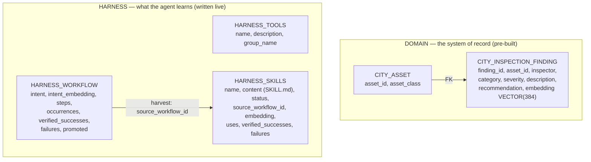

# Notebook 01 — Workshop Narration

A presenter's script for running **`01_self_improving_copilot_complete.ipynb`** live. For
each part it gives you three things: **what students see on screen**, **what to say**, and
**what to point at**. It also arms you with the honest caveats so nothing surprises you mid-room.

> **Run it clean.** Before the session: **Restart Kernel → Run All**, top to bottom, and let
> it finish untouched. The notebook resets its own learned state at the registry DDL, so a
> clean run is reproducible. Do *not* click individual cells out of order — helper functions
> (`follow_workflow`) and state (`WID`, the seed runs) are defined in earlier cells, and
> skipping them produces `NameError`s and stale-counter confusion.

---

## 0 · The one-sentence premise

> "The prerequisite workshop built a copilot with memory. A review found its learning would
> **rot**: it learned from a *sorted set of tool names*, and it called any run with a final
> answer a *success* without ever checking. This notebook rebuilds learning so it's
> **grounded in the full trajectory** and **verified against the database** — and then lets
> good procedures **earn authority** over time."

Everything durable lives in **Oracle**, and embeddings are computed **inside** the database
(ONNX) — no text leaves for a third-party embedder. Keep coming back to two words: **grounded**
and **verified**.

---

## 1 · The data model — draw this first

Two kinds of tables. **Domain** = the city's system of record (pre-built). **Harness** = the
three registries the agent *writes to as it learns*.



**What to say, table by table:**

| Table | One-liner for the room |
|---|---|
| `CITY_ASSET` | "The registry of things we inspect — a bridge, a sensor. `finding`s point back here by foreign key, so you can't log against an asset that doesn't exist." |
| `CITY_INSPECTION_FINDING` | "The findings corpus. Each row carries a **384-dim vector** of its description, embedded *in the database*. This is what similarity search runs over." |
| `HARNESS_TOOLS` | "The tool catalogue — each tool tagged with a **capability group**. No embeddings here; tool discovery is by disclosure, not search (Part 4)." |
| `HARNESS_WORKFLOW` | "One row per **recurring task type**. The three counters — `occurrences`, `verified_successes`, `failures` — are the whole game: they decide what gets harvested." |
| `HARNESS_SKILLS` | "Distilled `SKILL.md` procedures with a **lifecycle**: `provisional → approved → retired`. Linked back to the workflow they came from." |

> **Point at:** the three counters on `HARNESS_WORKFLOW` and the `status` on `HARNESS_SKILLS`.
> Tell them: "Watch these numbers move. That's the lesson."

---

## 2 · The through-line — follow ONE item end to end

The whole notebook is best narrated as a single story. Pick the **corrosion task** and follow it:

> A corrosion report comes in on **Harbor Bridge**. The copilot handles it once. Then a
> reworded version. Then the same procedure on a *different* bridge. By the third time, the
> harness recognizes a **pattern**, distills it into a **skill**, and the *next* corrosion
> job is done with that skill in hand — which, once verified twice, **promotes** the skill to
> approved.

Keep saying "the pea" — the notebook literally follows one workflow row (`WID`) through every
checkpoint with a `follow_workflow(...)` line that prints:

```
PEA d88883 | after occ 3 | occ=3 verified=3 fail=0 promoted=Y | HARVEST-READY | skill '...'
```

That `PEA …` line is your anchor. Read it out loud at each checkpoint.

---

## 3 · The agent — what the copilot actually does

`run_copilot_task(task)` runs a normal tool-calling loop, with two things the review demanded:

1. **It captures the *full trajectory*** — every step records the **tool, its arguments, and a
   truncated result, in order**. Not tool *names*: names alone are nothing to distill a
   procedure from.
2. **Tool errors don't crash the run** — an error becomes `ERROR: …` text the model can
   recover from, and it stays *visible* in the trajectory for the judge to see.

**What to say:** "The copilot isn't magic. Mechanically it's *search history, then log a
finding*. The intelligence is that what the search returns **shapes** what it logs — the
severity it picks, the prior findings it cites — but nothing in the code *forces* that. That's
exactly why we verify the outcome instead of trusting the process."

### Worked example — one real trajectory

Task: *"Review Harbor Bridge: pull its recent findings and its asset class, then record a new
finding for a cracked weld at the pier-4 girder seam."* Students see:

```
1. open_capability({'group': 'inspection'}) -> opened 'inspection'. Now available: tool_get_asset, ...
2. tool_find_similar_findings({'description': 'cracked weld at pier-4 girder seam', ...}) -> [{"finding_id":"643494c5-7cd", ...
3. tool_recent_findings({'asset_id': 'Harbor Bridge'}) -> [{"finding_id":"4092dad1-2e0","category":"corrosion", ...
4. tool_get_asset({'asset_id': 'Harbor Bridge'}) -> {"asset_id":"Harbor Bridge","asset_class":"bridge"}
5. tool_log_finding({'asset_id':'Harbor Bridge','category':'structural / weld crack','severity':'high',
     'description':'Cracked weld at Pier-4 girder seam. Duplicate location of prior HIGH findings (643494c5-7cd, ...',
     'recommendation':'Within 14 days perform NDT ...'}) -> 69844d1f-f94
  -> CITY_INSPECTION_FINDING: 346 -> 347 rows (1 finding written)
```

> **Point at step 5:** "It set severity `high` because the *search* in step 2 showed prior
> HIGH findings at this location — and it **cited those finding_ids** in its answer. Hold that
> thought; the judge is about to re-query them."

---

## 4 · Progressive disclosure — how the agent finds tools

**The problem it solves:** you can't dump 50 tool schemas into every prompt — it's expensive
and it distracts the model. So tools come in **two levels**.

- **Level 1 — the hot set + a meta-tool, always bound:**
  ```
  HOT = [tool_find_similar_findings, tool_log_finding]      # the search→log core
  + open_capability(group)                                  # the meta-tool
  ```
- **Level 2 — capability groups, disclosed on demand:**
  ```
  inspection : tool_get_asset, tool_recent_findings, tool_finding_detail
  recording  : tool_update_severity, tool_set_recommendation
  ```

The agent doesn't see a menu of labels — it reads a **routing rubric of conditionals** (so it
maps *need → group* without guessing):

```
- If you need to look up an asset's class, list its recent findings, or read the full
  detail of a specific finding, call open_capability('inspection').
- If you need to amend an EXISTING finding - change severity or set a recommendation,
  call open_capability('recording').
```

**The mechanism, in one breath:** each turn the agent's tools are re-bound to *HOT +
open_capability + the tools of every group it has already opened*. Calling
`open_capability('inspection')` adds that group's tools to the binding on the **next** turn.

> **What students see** (from the trajectory above): the agent's very first move is
> `open_capability('inspection')` — because the task needs the asset class and recent findings,
> which are **cold** tools. The common case (`find_similar → log`) never opens anything,
> because those two are already hot.

> **Say this:** "This is the difference between a tool *catalogue* and a tool *prompt*. The
> catalogue can be huge; the prompt stays small. The agent pulls capability into context only
> when its own reasoning says it needs it."

---

## 5 · Judging — verified success (the heart of the notebook)

The old copilot's bug was `success = bool(final_answer)`. Confident nonsense passed. The fix:
**a judge that audits the database, not the prose.**

Two pieces:

1. **`build_evidence(answer)`** — pulls every `finding_id` the answer *cites*, re-queries each
   against `CITY_INSPECTION_FINDING`, and tags it `EXISTS` or `NOT FOUND`. This is the "ground
   truth" the judge sees.
2. **The judge** — an LLM given *task + trajectory + answer + that evidence*, returning a
   **structured** `verified: bool` (via `with_structured_output`). It marks `verified=true`
   only if **all three** hold:

   > (a) the trajectory shows the copilot did what the task required (searched before
   > recording; recorded when asked);
   > (b) every `finding_id` cited in the answer appears in the evidence as `EXISTS`;
   > (c) the answer doesn't contradict the trajectory or invent records.

> **Say this:** "Clause (b) is the one with teeth. Re-querying the finding the agent *just
> wrote* is nearly tautological — of course it exists. The value is catching a **fabricated
> citation**."

### Worked example — "does the DB audit actually bite?" (the teeth demo)

The notebook takes one honest run, then splices **one fake citation** into its answer and
re-judges. Students see:

```
finding 643494c5-7cd EXISTS: asset=Harbor Bridge category=structural / weld crack severity=high
finding deadbeef-000  NOT FOUND in CITY_INSPECTION_FINDING

  honest run   -> verified=True
  tampered run -> verified=False: the answer cites deadbeef-000, but the evidence shows it NOT FOUND
```

> **Point at:** the two lines. "Same trajectory, same work — one fabricated `finding_id` in
> the summary, and the judge rejects it. *That's* the difference between checking prose and
> checking the record."

---

## 6 · Capture — dedup by meaning (recur, don't split)

After a run is judged, `capture_workflow` decides: **is this a new task type, or another
occurrence of one we've seen?** It embeds the task's intent, finds the nearest existing
workflow by **cosine `VECTOR_DISTANCE`**, and applies a **gray-band** rule:

```
distance < 0.15   →  merge   (certainly the same task)
0.15 – 0.40       →  ask     (LLM decides: same recurring task?)
distance > 0.40   →  new     (certainly different)
```

The middle band is the honest part: distance alone can't settle "same procedure, different
asset," so it escalates to a one-shot LLM check.

### Worked example — the three occurrences (this is the merge demo)

| Run | Task (paraphrased) | What happens | PEA line |
|---|---|---|---|
| **Occ 1** | Harbor Bridge, corrosion on bearing plates | new workflow row | `occ=1 verified=1` |
| **Occ 2** | *Reworded* corrosion check, Harbor Bridge | **merges** (near-paraphrase, small distance) | `occ=2` — **same** `workflow_id` |
| **Occ 3** | *Different bridge*, same procedure | **gray band → LLM says "same task" → merges** | `occ=3 verified=3` **HARVEST-READY** |

> **Point at:** the `PEA` id staying **the same** across all three, and `occ` climbing 1→2→3.
> "A second row appearing here would be the **silent split** — the failure mode where the same
> procedure fragments into look-alikes and never accumulates enough evidence to be learned."

---

## 7 · Harvest — turn a pattern into a skill

A workflow is **harvest-ready** only when it *recurs* **and** *verifiably works*:

```
occurrences ≥ 3   AND   verified_successes ≥ 2   AND   verified_successes > failures
```

When it clears the gate, `harvest()`:
1. **Distills** the trajectory into a `SKILL.md` (name, when-to-use, parameterized steps) —
   grounded in what actually happened, told not to invent steps. *(It filters out
   `open_capability` first — that's harness plumbing, not a domain step.)*
2. **Faithfulness check** — a second model call compares the distilled steps back against the
   trajectory. *Unfaithful distillations are rejected and nothing is written.*
3. Writes the skill as **`provisional`** and marks the workflow `promoted`.

Students see:

```
harvested PROVISIONAL skill 'assess_corrosion_finding_against_history' (20e0fef4) from workflow d88883
```

> **Say this:** "Two gates, not one. The **harvest gate** (recurs + verified) decides *whether*
> to learn. The **faithfulness gate** decides whether the thing we wrote down is *true to what
> happened*. A skill that hallucinates a step never gets saved."

---

## 8 · Promotion — a skill earns authority

A `provisional` skill is a *candidate*. It's injected into later runs **labeled as unproven**,
and its outcomes are fed back. The lifecycle:

```
provisional --( verified_successes ≥ 2  AND  failures == 0 )--> approved
any status  --( failures ≥ 2 )--> retired
```

### Worked example — provisional → approved

The notebook runs the corrosion procedure two more times *with the skill available* (`r4`,
`r5`). Each verified use updates the skill's own counters. Students watch:

```
after skill use 1  →  provisional  uses=1 verified=1 failed=0
after skill use 2  →  approved     uses=2 verified=2 failed=0    ← promotion fires
```

> **Point at:** `status` flipping to `approved`. "It didn't get promoted because *we* said so.
> It got promoted because it was **used and verified** twice with no failures. Authority is
> earned from outcomes."

---

## 9 · Usage — the skill changes the next run

When the skill exists, `build_skill_manifest(task)` retrieves it by similarity (cosine,
threshold `0.65`, retired skills excluded) and injects it into the system prompt — **approved
skills labeled "prefer this approach," provisional ones labeled "unproven candidate, verify
against fresh data."** The run records which `skill_ids` it used, closing the loop.

> **Say this:** "This is the payoff. A future corrosion job doesn't start from zero — it starts
> with a verified procedure in context. And because we track `skill_ids`, every use keeps
> feeding the lifecycle. The system gets better at the jobs it does often."

### 9a · How retrieval actually works (and why a skill sometimes misses)

Retrieval happens in **two phases**, and only one of them ever steers the agent:

- **Phase 1 — apply (before acting).** The task is vector-searched against **skills**; matches
  are injected into the prompt. **Skills are the "apply" layer.**
- **Phase 2 — account (after acting).** The task is vector-searched against **workflows**, but
  *only* to decide merge-vs-new and bump `occurrences`. Workflows are never injected or
  executed. **Workflows are the "accounting" layer** — they count until a task type earns a skill.

So when both match (a task type that's already been harvested), the **skill** steers the run and
the **workflow** just gets its counter bumped. They don't compete.

**What a "task" is:** there is no separate intent object — the "task" is the **raw
natural-language string** you pass to `run_and_learn(...)`, embedded *whole*, in-database, no
rewriting. The same raw string is what Phase 2 stores as the workflow's `intent`.

**The asymmetry that matters:** a skill is embedded from just its **`"name: description"`** — not
its full `SKILL.md`. So Phase-1 matching is:

```
embed(raw task string)   vs   embed("skill_name: skill_description")   →   keep if cosine ≤ 0.65
```

> **Say this — the answer to "why didn't the skill fire?":** because we're matching *raw task
> text* against a *short skill summary* with a hard `0.65` floor, **phrasing matters**. A task
> that means the same thing but is worded far from the skill's name/description can land past
> the threshold and **miss** — the skill won't be injected even though it's relevant. (That's
> exactly what happened when `r4`'s "pitting on expansion-joint anchor bolts" wording drifted
> too far from the corrosion skill; rewording it closer fixed it.) In production you'd soften
> this with better skill descriptions, query expansion, or a higher-recall first pass.

---

## 10 · Putting it together — `run_and_learn`

Every arc run is one call:

```
run_and_learn(task)  =  act  →  judge  →  capture  →  learn
                        (agent) (verified?) (merge/new) (update skill outcomes)
```

— all inside a single Langfuse trace, so every model call, tool call, and the verdict are one
auditable unit.

---

## 11 · Presenter caveats — read before you run it live

These are the things that can bite you in the room. Know them.

- **The agent is stochastic.** Given the same task it *usually* does the right thing, but
  sometimes it explores and forgets to record, and the judge (correctly) rejects it. To keep
  the teaching arc reproducible, the seed runs use `max_tries=3` and **retry until verified;
  only the final attempt is captured**, so retries never inflate the counters. If you see
  `(attempt 1 unverified, retrying: …)` — that's normal, it's the harness insisting on a clean
  run before it learns from it.
- **Prompt instructions steer; they don't bind.** Even with "you MUST record the finding," the
  model occasionally skips it. If a *skill-use* run (`r4`/`r5`) fails **all** its retries, it
  logs a `failure` on the skill — and because promotion requires `failures == 0`, that run can
  **block the `provisional → approved` step**. If promotion doesn't fire, this is why. A
  **Restart → Run All** re-rolls it; a production system would instead *guarantee* the record
  step in code rather than ask for it.
- **State is cumulative unless reset.** The harness tables persist across runs; the notebook
  clears them at the registry DDL cell (`… learned state reset`). If counters look too high
  (e.g. `occ=5` at an "after occ 3" checkpoint), that cell didn't run — you skipped it or ran
  cells out of order. Restart → Run All fixes it.
- **The editor can hold a stale copy.** If you regenerate or pull a new notebook while it's
  open, VS Code may keep the old in-memory version. **Revert/reopen the file** so the editor
  matches disk before you run.
- **"The skill didn't fire" is usually a phrasing miss, not a bug.** Skill retrieval matches raw
  task text against the skill's short `name: description` with a hard `0.65` cosine floor (see
  §9a). If a relevant skill isn't injected, the task was likely worded too far from that summary
  — reword closer, or check the distance. It is *not* evidence the skill was lost or retired.

---

## 12 · The 90-second recap slide

> "One task came in. The copilot **acted** (pulling in tools only as it needed them), and a
> judge **verified** the result against the database — not the prose. The same task recurred,
> and the harness **recognized the pattern** instead of splitting it. Once it had recurred and
> verifiably worked, it **harvested a skill** — and only kept it if the write-up was faithful
> to what actually happened. That skill started **provisional**, proved itself on two more
> verified runs, and **earned approval** — after which it shapes every future run. Grounded,
> verified, earned. That's a harness that learns without rotting."
